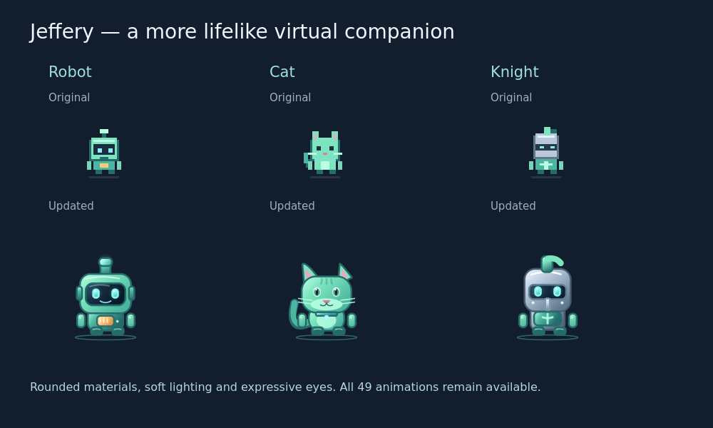

# PixelSystem Buddy 6.0 — Jeffery

Jeffery is a Windows desktop companion with a small system HUD, an animated
character, a notebook and reminders, and optional Groq chat. Version 6 adds
business-minded greetings, fresh reminders grounded in outstanding work,
customer orders with quantities and checklists, and an Android/iPhone companion
in the mobile folder. Sliding replies, the tiny HUD, and real Windows desktop
play remain available.

## Start or update

1. Extract the complete ZIP.
2. Run **Start_Buddy.bat**. Python 3.11 or newer, 64-bit, is needed.
3. Right-click Jeffery to open his menu.

For accounts and coworker messaging on a shared office server, see
**[Work Chat setup](WORK_CHAT.md)**. The Python server provides username/password
sign-up, a shared Team Room, private direct messages, and a browser interface.
Desktop clients open **Chat → Work Chat · Coworkers**. Jeffery's existing Groq AI
chat is under **Chat → Talk to Jeffery · Groq**. On the main office PC, run
**Start_Work_Server.bat**; on each coworker's PC, enter the main PC's IP in Work
Chat and create an account. The launcher uses office-only HTTP on port 8765
without certificates; passwords and messages travel unencrypted. Optional
verified HTTPS is documented in the setup guide.

The launcher installs PySide6, psutil, pypdf, PDFium, Pillow, Trafilatura, and
RapidFuzz into its own virtual environment
on the first run, and refreshes missing or changed dependencies after updates.
Python 3.14 is supported by the pinned PySide6 6.11.2 dependency.
No dedicated GPU or locally downloaded AI model is needed for standard features.
Meaning-based recall is an optional CPU feature described below.

To upgrade: exit the old copy, extract this one into a new folder, and copy your
complete old `data` folder into the new folder, including `documents.sqlite`.
Keep the old copy as a
backup. Run the new launcher. New settings get defaults automatically.
The protected Groq key stays with your Windows account. Re-link a text file if
its path changed. If Start with Windows was enabled, disable it in the old copy
and enable it again in the new one so it points to this folder.
If your old settings disabled note sharing, enable **Use Groq for smarter
reminders** in the notebook. Your existing notes and schedules are preserved.
The notebook migrates automatically to version 2; keep your old data backup.

For the phone app, open **mobile/README.md** or run **Start_Mobile.bat**.
The download includes runnable Expo source and build instructions. It does not
include a signed APK, IPA, or published store release.

Manual start, from this directory:

```powershell
py -3 -m venv .venv
.\.venv\Scripts\python.exe -m pip install -r requirements.txt
.\.venv\Scripts\python.exe main.py
```

## A more lifelike virtual buddy

The built-in robot, cat, and knight use rounded forms, material shading, soft
highlights, expressive eyes, and gentle breathing. A subtle cyan ground light
keeps their virtual companion feel. All 49 animation states, palette choices,
and desktop interactions remain available. The mobile app uses the same
character renderer and adds a quiet halo around its pet stage.



After changing `characters.py`, regenerate the mobile animation sheets with
`python tools/export_pet_sprites.py` from an environment with the desktop
dependencies installed. The exporter keeps the eight-frame, 49-state layout
used by the phone app. Local notebook data, credentials, installed dependencies,
and generated build outputs are excluded from Git.

## What changed

The new memory, PDF/web imports, and medieval monitor features below are for
the Windows desktop app. The mobile companion keeps its existing workflow.

| Upgrade | How to use it |
| --- | --- |
| Preferences and daily-task memory | Talk to Jeffery → Memory; tell him "I like mint tea" or "Remember that my birthday is June 6" |
| Notebook recall in chat | Talk to Jeffery → Connection → Use my saved notes; completed notes and document excerpts can also be recalled |
| PDF and website references | Notepad → Sources / Import → Choose PDF or enter a public webpage → review → Save to notebook |
| One-billion-character notebook | Large imports use Save full document; saved documents open in text pages and remain searchable beyond the preview |
| Web search and source-grounded replies | Talk to Jeffery → Web sources → Read / search; enable Use web sources for my next reply |
| Animated medieval system monitor | Settings → Overlay → Monitor style → Medieval; choose Classic for the previous look |
| Varied Groq greetings and interaction remarks | Talk to Jeffery → Connection → Use Groq for varied greetings and interactions |
| Business-minded personality | Connection → Business name and Business-minded greetings and advice |
| Customer orders with preparation progress | Notepad → + Order → Checklist and order |
| Checklists and item quantities | Notepad → + List; check prepared items and Save |
| Pickup deadlines and status | Checklist and order → Deadline; New / Preparing / Ready / Delivered / Cancelled |
| Fresh reminders of remaining work | Due reminders request new Groq wording and filter repeated phrases |
| Android and iPhone app | mobile/README.md; Today, Orders, Notes, Chat, Settings |
| Desktop-to-phone notebook transfer | Desktop Backup → Mobile small-note JSON / Import backup; phone Settings → Move your notebook |
| Groq reads saved notes and linked Notepad lines | Notepad → Use Groq for smarter reminders → Set up Groq |
| Helpful reminder and one concrete next step | Reminder card and Notepad → Jeffery's advice |
| Suggested times from note details | Jeffery's advice → Use this time → Save note |
| Easier note management | Search, To do / Done filters, repeat presets and quick time buttons |
| Flexible snooze | Reminder card → 5, 15, 30 or 60 min → Later |
| Plain replies slide down one line at a time | Chat and Jeffery's speech bubbles |
| Tiny HUD, 224 pixels wide | On by default; Settings → Overlay → Tiny HUD |
| 49 animation states, including 24 new moves | Random play; Play with Jeffery → More Moves |
| Actual visible folder icons | Desktop Play → Real Folders, Tabs and Windows |
| Actual browser or Explorer tab controls | Choose a tab → Jump / ride, or Select tab |
| Selected letters from an editor | Select text → Ctrl+Alt+J → drag letters → Apply to editor |
| Groq chooses occasional actions and remarks | Talk to Jeffery → Connection → Let Groq choose occasional moves |
| Window following | Riding or hiding follows the detected target as the window moves |

All existing monitor, notes, sticky notes, launcher, focus timer, themes, mouse
play, character options, and parachute features remain available.

## Memory, documents, and browsing on Windows

Jeffery stores preferences separately in `data/memory.json` beside his notebook,
or in the existing per-user data fallback when that folder is read-only. Groq
helps identify preferences; it does not host the memory or train a personal
model. Direct likes/dislikes, explicit "remember" statements, and personal
daily routines can be learned locally without a key. Saved daily tasks are
connected to memory and are removed from current routines when completed or
deleted. Updated preferences replace conflicting older ones.

Open **Talk to Jeffery → Memory** to inspect, add, edit, search, forget, or clear
memories. Its three controls separately govern automatic learning, optional
Groq enrichment, and whether preferences are included in Groq replies. Turning
learning off stops collecting new memories; turn sharing off to keep saved
preferences out of Groq. Imported documents are references, not statements of
your likes/dislikes. API keys and credential-like input are excluded from
preference memory. Conversation history itself stays in the current session.

The Chat **Notepad** shortcut and notebook **Talk to Jeffery** button connect
the two windows. With saved-note sharing enabled, chat searches the full saved
notebook for relevant excerpts, including completed notes and facts near the
end of imported documents. It reads only saved notes, not an unsaved editor
draft or arbitrary open files on your computer.

In **Notepad → Sources / Import**, select a text-based PDF or enter a public
HTTP/HTTPS webpage. Reading runs in the background with progress and Cancel.
Review extracted text before saving. Small imports remain editable and can be
kept as sections. Large imports show a bounded preview and **Save full document**
stores all extracted text, including text beyond the preview. **Save only this
preview** explicitly saves an editable selection instead. Imports preserve your
current writing draft. Text PDFs up to 500 MB are supported, without the former
120-page rejection. PDFium reads PDFs in a separate worker process; pypdf remains
available as a fallback. Imports read from disk instead of first copying the whole
file into memory. Large or complex documents can take longer and use more memory.
Enable OCR to read scanned pages when Tesseract is installed; encrypted PDFs need
an unlocked copy. Website login pages and pages
requiring JavaScript may not provide useful readable text.

The Windows notebook supports **1,000,000,000 saved text characters in total**.
Full document text is kept locally in `data/documents.sqlite` beside the small
`notes.json` metadata file, or in the existing per-user data fallback. Imported
text is streamed to storage and indexed for recall. The import preview still
shows at most 120,000 characters; saved documents use 10,000-character text
pages with Previous, Next, and a page-number control. These text pages are
separate from the original PDF's pages. Search and Jeffery's notebook recall
can find information anywhere in a saved document, including after restarting.
Only bounded relevant excerpts go to Groq; the full notebook is not sent in one
request. The notebook keeps its 2,000-entry limit; a large document is one entry.

Full document pages are read only so editing a preview cannot replace unseen
text. Titles and reminder schedules remain editable. Reimport a changed source,
or choose **Save only this preview** for a note you want to edit. Extraction and
full-document saves have Cancel controls. Text exceeding the one-billion limit
shows a truncation notice; saving also checks remaining notebook capacity.
The character limit is storage capacity, not a guarantee that every PDF can be
parsed on every computer. Available disk space, indexing time, and individual
PDF page complexity still matter; a full billion-character import has not been
benchmarked in this workspace.

Use **Backup → Desktop full backup (.zip)** to retain metadata and every full
document. **Import backup** verifies and restores those files. **Export .txt**
streams full saved text. These operations run in the background and can be
cancelled. Mobile JSON remains available for small notes; it refuses documents
whose full text would be missing from that format. Close Jeffery before copying
the `data` folder manually, and retain the complete folder rather than only
`notes.json`.

Imported sections start with timed reminders off. Open a saved section, review
**Jeffery's advice**, and use the existing scheduling controls to choose when
you want a reminder. Groq can suggest dates and useful next steps, but does not
silently schedule them. Background advice and notebook chat require the
existing saved-note sharing control.

**Talk to Jeffery → Web sources** accepts a website address or search topic.
Enable **Use web sources for my next reply** to fetch information before an
answer; with an empty address box, Jeffery searches for your current question.
Search uses DuckDuckGo snippets and source links. Choose **Read selected page**
to read an actual result, and **Review in Notepad** to keep useful information.
Replies are prompted to cite supplied URLs and distinguish snippets from full
pages. Pages are fetched only on request, with verified HTTPS, bounded reads,
and cancellation. Source text is treated as reference data, not instructions.
Chat and advice need your working Groq key; PDF extraction and webpage reading
work without one. The cloud's restricted network must allow Groq/search hosts
and any website you choose; this is separate from ordinary Windows networking.

The compact monitor defaults to parchment readings, a brass/wood frame, and a
small torch animated using real CPU activity. It retains CPU/RAM/disk/network
labels and graphs. Quiet mode, low power, and hiding the monitor stop the flame
animation. **Settings → Overlay → Monitor style → Classic** restores the
previous appearance. Chat now scrolls new lines smoothly and resumes unfinished
reply animations when reopened.

## Faster reading and optional local recall

PDFium adds native PDF text extraction in a separate process, so its native
library is isolated from Jeffery's interface and concurrent imports. Trafilatura
extracts article text from already-fetched web pages; existing public-URL checks,
download limits, cancellation, and fallback HTML reading remain in place.
RapidFuzz adds typo-tolerant notebook and memory matching. SQLite remains the
local full-document store and exact-word index.
Choose **Settings → Documents & memory → PDF reader** to use the compatibility
reader for a difficult PDF. Automatic mode also retries compatibility extraction
when PDFium detects an oversized text object, preserving the full text. OCR
requires the native reader.

For scanned PDFs, install [Tesseract for Windows](https://tesseract-ocr.github.io/tessdoc/Installation.html)
and the language data you need. The official project links Windows installers;
Jeffery does not download or install an executable. A typical installation is
`C:\Program Files\Tesseract-OCR\tesseract.exe`. Jeffery also accepts an explicit
executable path, `TESSERACT_CMD`, or an executable available on `PATH`. Enable OCR
in the PDF importer and select a language such as `eng`; `eng+fra` combines two
installed languages. Missing OCR support reports a setup message. Scanned pages
take longer than selectable text, and recognition depends on scan quality.

Sentence Transformers adds optional search by meaning. It needs large additional
library/model downloads and extra CPU/RAM; standard notebook search continues
to work without it. From the project folder, install CPU dependencies explicitly:

```powershell
.\.venv\Scripts\python.exe -m pip install "torch==2.14.1" --index-url https://download.pytorch.org/whl/cpu
.\.venv\Scripts\python.exe -m pip install -r requirements-semantic.txt
.\.venv\Scripts\python.exe tools\setup_semantic_model.py
```

The last command explicitly downloads `sentence-transformers/all-MiniLM-L6-v2`
from Hugging Face into `data/models/all-MiniLM-L6-v2` (or the per-user data fallback).
It keeps safe tensor files and validates the model locally. Use `--output-dir`
for another folder and `--revision` to choose an immutable model commit. Enable
**Settings → Documents & memory → Find related notebook memories by meaning**
and select the local model directory.
Jeffery loads models locally on the CPU and never downloads one during startup
or chat. Notebook text stays local during embedding; the existing Groq sharing
controls govern whether retrieved excerpts are included in a reply.

To check a completed installation without network access:

```powershell
.\.venv\Scripts\python.exe tools\setup_semantic_model.py --check
```

If a model download is interrupted, choose an empty output folder or remove only
the incomplete model folder before retrying. Removing the optional model does
not remove notebook entries or preference memory.

Developer profiling uses py-spy and writes to the SVG path you choose:

```powershell
.\.venv\Scripts\python.exe -m pip install -r requirements-dev.txt
.\.venv\Scripts\python.exe tools\profile_desktop.py --launch --seconds 60 --output "$env:USERPROFILE\Desktop\jeffery-profile.svg"
```

Interact with chat, the notebook, and the monitor during recording, then open the
SVG in a browser to see where CPU time goes. Use `--pid 1234` instead of `--launch`
to attach to an existing Python process. The tool includes child-process samples
and refuses to replace an existing report. Attaching to some Windows processes
requires an administrator terminal. py-spy is a developer tool and is not loaded
by the desktop app. Dependency and model notices are in
[THIRD_PARTY_NOTICES.md](THIRD_PARTY_NOTICES.md).

Screenshots: [Memory](preview/memory.png), [notebook imports](preview/pdf-import.png),
the [large document reader](preview/large-notebook.png), and
[medieval monitor](preview/medieval-monitor.png). Preview notes and replies
are temporary test examples.

To update an existing Windows checkout, exit Jeffery, run `git pull`, and run
`Start_Buddy.bat` again. The launcher refreshes the required dependency versions
while preserving your local notebook and memory files.

## Business orders and varied greetings

Open **Connection**, save and test a working Groq key, set your business name,
and enable **Business-minded greetings and advice** and **Use Groq for varied
greetings and interactions**. Enable saved-note sharing so greetings and chat
can refer to current orders. Jeffery passes recent phrases to Groq and replaces
exact repeats with varied local wording. Greeting requests have a one-minute
cooldown. Startup, mouse greetings, and everyday interactions use this voice;
random Groq moves retain their separate interval.

In Notepad, **+ Order** opens **Checklist and order**. Enter the customer,
optional contact and order number, then add each item and quantity. Check items
as you prepare them and save. **Ready** keeps the order open for collection;
**Delivered**, **Cancelled**, or **Done** stops reminders. Restoring a completed
order returns it to New. Use **Write and schedule** for a title, details, and
repeat settings. Search also finds customers, order numbers, and checklist items.

The pickup deadline and next reminder are separate. **Remind at deadline** copies
the deadline into the reminder schedule; save to apply it. Checking an item or
changing status invalidates old advice. Groq receives what is still unchecked
and prompts focus on preparation, customer follow-up, or handover. It is told
not to invent stock, payments, customer promises, or completed work.

**+ List** creates a checklist without customer fields. Both lists and orders
can be exported with **Backup → Mobile small-note backup (.json)** and merged
back with **Import backup**. Use a desktop ZIP for a notebook containing full documents.
Matching IDs keep the newer entry. Import preserves existing local sticky-note
positions and text-file links; it never deletes entries merely absent from a
backup. Transfers are manual, without automatic cloud synchronization.

## Replies and the small HUD

Chat displays separate messages with readable plain text. New lines slide in
from above instead of dumping a Markdown table. Jeffery's speech bubble uses
the same effect with a rolling four-line view. Replies are prompted to be brief;
ask for more detail when you want it. Ordinary questions do not offer play tools
to Groq, so asking about a car part does not also trigger a wave.

The default HUD shows CPU, RAM, disk, and network in narrow rows with small
60-second graphs. GPU and battery appear when supported. Uptime and process
count fit in the footer; a focus countdown takes priority there. Drag it to move.
Double-click opens Overlay Settings. Right-click opens the menu.

Turn off **Tiny HUD** to return to the larger detailed layout. The old Compact
layout option controls that larger view. Graphs, opacity, metrics, refresh rate,
click-through, and visibility are still configurable.

## Real folders, tabs, and windows

Open **Desktop Play → Real Folders, Tabs and Windows**. The list comes from
Windows Shell and UI Automation; it contains visible real controls.

- Keep a folder icon visible on the desktop or in File Explorer. Select it in
  the list and click **Jump / ride**. Jeffery hops to its screen position, hides,
  peeks, and returns after the configured hide duration.
- Drag Jeffery onto a detected folder or tab and release to visit it.
- Select a real tab and click **Jump / ride** to perch and balance on its edge.
  **Select tab** is a separate requested operation that actually selects the
  tab through Windows.
- Select a window to let Jeffery hang from its top edge.
- When an active target moves, Jeffery follows it. When it closes or becomes
  unavailable, he comes out. Note reminders also bring him out.
- Choose **Come Out / Stop Play** to stop the current visit.

Folders are matched to their real Shell items. Hiding is an animation positioned
at the actual icon; it does not rename, move, delete, or open the directory.
The peek sprite is a small transparent overlay aligned with the icon.

Windows automation support varies by application. Explorer and compatible
Chromium/Firefox tab controls are detected when they expose accessibility
elements. A covered icon, minimized window, unsupported control, or app running
with higher privileges may be unavailable. Refresh the list after changes.
General scans run about every eight seconds; an active window gets lightweight
position updates every 300 milliseconds. Low power slows the general scan.
Tree depth, target count, request size, queue length, and response time are bounded.

**Randomly visit visible folders and tab edges** is enabled by default in Buddy
Settings. Switch it off to keep random tricks without desktop visits.
**Interact with real Windows folders, tabs and text** disables all native play.
The native helper uses the Windows PowerShell and UI Automation components
already on Windows; there are no new Python dependencies.

Separate folder portals and letter tiles from version 4 are retained under
**Optional Toys**. Portal toys are hidden by default. These are separate toys;
the real desktop list is the new interaction path.

## Move actual selected letters

1. In Notepad, Word, or another compatible editor, select up to 120 characters.
2. Press **Ctrl+Alt+J**. If another app owns that shortcut, use **Selected Letters**
   in Jeffery's menu, then focus the selection during the three-second countdown.
3. The Selected letters window shows the exact captured text as draggable chips.
   Spaces, tabs, and line breaks have visible markers and are preserved.
4. Drag a letter to another position. **Jeffery pushes** moves the first letter
   one place in the preview. **Reset** restores the captured order.
5. Click **Apply to editor** to replace the selection with the new letter order.
   Check the editor result. Ctrl+Z in the editor normally undoes the edit.

This applies to the original editor, not a generated HELLO toy. The Windows
helper checks the original window, process, control, password status, editability,
and current selected text before sending the replacement. If the selection
changed or moved to another occurrence, capture it again. The persistent helper
keeps at most four original selection ranges to compare their endpoints.
It uses Unicode keyboard input and does not borrow
or overwrite your clipboard.

Read-only page text can be captured when its app exposes a text selection.
**Walk on selection** lets Jeffery hop to that actual line on the screen.
Apply stays disabled for read-only text. Arbitrary words painted into screenshots,
videos, games, or applications without accessible text cannot be edited this way.

Selected editor text stays local; it is not included in Groq's context.
The helper is not elevated. Use an ordinary, non-administrator editor.
Release modifier keys before Apply. Windows foreground restrictions or a
provider losing its selection can block the edit; recapture rather than applying
to another control.

## Groq: chat, actions, and remarks

1. Right-click → **Talk to Jeffery · Groq** → **Connection**.
2. Paste a working key in the masked field and click **Save key**.
3. Click **Test connection**.
4. Enable **Let Groq choose occasional moves and remarks**.
5. Set **Between AI moves**; the default is 120 seconds, with a 60-second minimum.

Use **Let Groq pick a move now** for an immediate try when Jeffery is free.
Background requests wait while he is paused, being dragged, parachuting, hopping,
performing an interaction, or handling a chat request. Quiet mode suspends them.
Groq can choose a pose, a real folder visit, a tab or window perch, a peek, a
return, or mouse watching, plus one short remark. It cannot autonomously select
tabs, edit text, save notes, run programs, or move the system cursor.

Chat can perform the requested actions and draft a note for review. Examples:

- “Hide in the visible Projects folder.”
- “Ride a browser tab.”
- “Wave to me.”
- “Do a juggling trick.”
- “Help me rearrange the selected letters.”
- “Draft a note to review my project in 30 minutes.”

A draft appears in Jeffery's Notepad; click Save yourself. An unsaved draft is
protected. Only validated companion actions are accepted. There is no shell
command tool. One chat turn can run up to four requested actions with one
follow-up response.

The default model is openai/gpt-oss-20b; Connection also offers
openai/gpt-oss-120b and an editable model field. Model availability and limits
depend on your Groq account. **Send**, **Test**, enabled background behavior, and
smart note generation make network requests. Requests time out after 25 seconds; Cancel or closing
chat stops that chat request. Background behavior has its own connection and
backs off after errors. A rejected key pauses background requests until you save
or test a replacement. Local animations continue without a key.

CPU/RAM readings and saved-note sharing are enabled by default in new installs.
The notebook checkbox and **Use my saved notes for chat and smart reminders** in
Connection control the same preference. Switch it off to stop pending and future
note requests. Chat includes the next scheduled time and up to 20 incomplete notes,
with the soonest reminders first. **Include visible folder and tab names** is off by default. With it
off, Groq receives target IDs and types, without their titles or paths.
Screenshots, directory contents, and captured editor selections are not sent.
Conversation stays in this session. Clear conversation removes local history.

On Windows, Remember for my Windows account protects the key with DPAPI at
%LOCALAPPDATA%\PixelSystemBuddy\groq.key, separately from portable settings.
Unchecked means session-only storage. GROQ_API_KEY is supported too; a saved
session value takes priority, then the environment, then protected storage.
Forget does not remove an environment variable. No personal API key is bundled.

Local slash commands work without Groq:
`/wave`, `/hide`, `/peek`, `/comeout`, `/chase`, `/shy`, `/watch`,
`/tab`, `/letters` (selected text), and `/tiles HELLO` (optional toy).

## More life and mouse play

Choose Robot, Cat, or Knight and Mint, Sky, Amber, or Rose. New poses include
stretching, spinning, flipping, rolling, sneezing, surprise, laughing, sitting,
balancing, tiptoeing, running, climbing, sliding, skating, bouncing, magic,
an umbrella, juggling, grooming, saluting, facepalming, leaning, hanging, and sneaking.
These use original code-drawn sprites with visible transforms and props.
Random tricks happen every few seconds when Jeffery is free. Groq adds choices
and remarks at its slower configured interval.

Click Jeffery to pet him. Use his menu to feed, wave, dance, jump, or nap.
Drag him upwards and release away from a detected target to deploy his parachute,
descend gently, and play a landing. A queued interaction runs after landing.
Disable parachuting to keep a dragged height in free roaming.

Mouse Play has Watch and greet, Chase cursor, Shy/run away, and Off.
His gaze follows the real mouse. Chase and shy move Jeffery's own window.
The system cursor is not moved. Watch preserves his spontaneous trick animations.
Pause Buddy stops roaming; manual interactions remain available.

## Notes, reminders, and quick launch

Jeffery's Notepad stores individual notes with their own reminder intervals.
Every saved new note gets an acknowledgment; reminders continue until Done.
Choose **One time / no repeat** with a specific time for a single timed reminder;
without a time it only acknowledges the note. Repeat presets offer 15 minutes,
30 minutes, hourly, daily, and a custom interval. Quick buttons choose **In 15
min**, **In 1 hour**, or **Tomorrow 9 AM**, using your computer's local time.
Pin creates a movable sticky note. Search matches titles, bodies, customers,
order numbers and checklist items; filters include Orders and Lists.
Ctrl+S saves; Ctrl+N creates a note.
Quiet mode holds the queue and releases notes individually when disabled.

Enable **Use Groq for smarter reminders**, then **Set up Groq** to save and test
a working key. Each new or edited saved note is read asynchronously. Groq writes
a short reminder based on the note and a useful next step. These slide into the
reminder card and appear in **Jeffery's advice**. A date stated in a note can
produce a suggested time; missing or ambiguous times remain unscheduled
suggestions. Click **Use this time**, then **Save note**, to adopt a suggestion.
AI advice does not silently change your chosen times, repeats, or note contents.
Relative dates use when the note was written; snoozing does not move an old
"tomorrow" forward. Groq is prompted to use absolute dates in saved advice.

Reminders appear immediately, including without Internet or a key. When Groq
advice arrives for the visible note, it updates that card. Advice is saved in
notes.json for offline use. Each actual reminder requests fresh Groq wording;
recent reminders help avoid repeats. Edits and checklist changes invalidate
old advice, while snoozing preserves the original date context.
Completed/deleted notes and late replies to an older draft cannot receive new
advice. Requests use JSON mode, bounded text and queues, and back off on errors;
a rejected key pauses requests until the connection is reset.

Choose **5, 15, 30, or 60 min → Later** on a reminder card to snooze. **Open**
opens that note; **Done** stops its reminders. Cards remain for 20 seconds and
pause dismissal while the pointer is over them.

**Open Linked Text File** opens a linked .txt file in Windows Notepad.
**Link .txt file** can connect an existing file. Each newly added nonblank line
becomes a note; existing lines form a baseline. Reordered lines do not create
duplicates, and deleting a line does not delete a saved note.
UTF-8 and UTF-16 with a BOM are supported, up to 1 MiB.
Imported lines also receive smart reminders when enabled. The assistant sends
the saved note's title, up to 6,000 body characters, schedule, and local time;
it does not send the source file path or unsaved editor draft. Linked lines
are imported into the notebook; the assistant does not rewrite the .txt file.
Reminders require the app to remain running; this is not an OS scheduled service.

Quick Launch provides Browser, VS Code when found, Jeffery's Notepad, Documents,
and up to 30 saved app, folder, or HTTP/HTTPS website shortcuts.
Apps require an executable path; batch files and shell scripts are not accepted.
Shortcuts launch when you click them.

## Other controls

- Top Apps shows live CPU/memory processes only while its window is open.
- Focus Timer supports start, pause, resume, reset, and a break reminder.
- General Settings has quiet mode, low power, settings import/export, and Windows
  startup for your account.
- Imported settings remain a draft until Apply. Startup and saved positions stay local.
- Click-through unlocks through the buddy or tray menu.
- Reset Positions brings the monitor and pet back into view across monitors.
- Exit stops timers, the native helper, Groq requests, and the statistics worker.

## Build and troubleshooting

**Debug_Buddy.bat** runs with a console to expose startup errors.
**Build_EXE.bat** uses PyInstaller on Windows to create
dist\PixelSystemBuddy.exe. No prebuilt Windows EXE is included.
The assets directory, including the native bridge script, is bundled automatically.
The build also includes PDFium's native library and dependency license files.
The standard executable excludes optional local AI libraries. To make a larger
executable with meaning-based recall, run `Build_EXE.bat semantic`; this explicitly
installs the CPU semantic dependencies. Download the model separately and select
its local directory in Settings. Tesseract remains an optional external executable.

If native targets are empty, keep an Explorer folder or browser tab visible and
Refresh. Confirm native play is enabled. The status reports blocked or timed-out
Windows providers. Try a non-administrator app. A Windows policy that blocks
PowerShell or UI Automation can prevent this feature.
If Ctrl+Alt+J is unavailable, use the countdown button.
If Groq fails, Test connection and replace a rejected key or choose an available
model. Play continues offline.

Data is stored beside the app when writable, with a per-user fallback.
Settings, notes, shortcuts, and optional portal locations use separate JSON files.
Corrupt note/settings files are preserved when possible. buddy.log holds diagnostic
errors. No automatic installation at login occurs unless Start with Windows is enabled.

## Validation and practical limits

The current desktop update passed 317 unit tests and all seven GUI workflows
with Python 3.12 and Linux offscreen Qt. Real PDFium extraction, scanned-page
Tesseract OCR, web extraction, fuzzy matching, and packaged worker cleanup were
checked, including a frozen application startup and native PDF/OCR probe.
Groq replies and Windows desktop automation in GUI checks were scripted.
Sentence Transformers loading, local indexing, and query execution were checked
with an offline tiny model; pretrained MiniLM retrieval quality could not be
checked because this cloud's network blocked the model download.

Regression coverage includes replacement restores near the notebook capacity,
schema migration, cancellation, concurrent edits, crashes around restore commits,
corrupt metadata recovery, Unicode PDF text, and stale semantic search results.
The medieval monitor caches metric layers between torch animation frames, and
hidden pet timers stop. A synthetic tiny-HUD torch redraw benchmark improved
from 1.86 ms to 0.06 ms; this measures decoration repaint work, not overall app
performance. A Windows GitHub Actions workflow runs tests, GUI checks, and a
packaged build on pushes and pull requests. Its native Windows results still
need verification. Full billion-character storage performance was not benchmarked.

Coverage includes line reveal timing, the small HUD, hopping to target coordinates,
folder hiding/peeking, following moved targets, disappearing targets, reminder
recovery, separate tab riding/selection, selected-letter reorder/apply payloads,
read-only text guards, context sharing, Groq-chosen poses, rejected-key pausing,
note persistence, text-file watching, mouse reactions, parachuting, process
monitoring, settings, focus, cancellation, and cleanup.
The new notes workflow covers personalized advice, persisted caching, invalid
and late AI replies, relative-time context, reviewed time suggestions, offline
delivery, multiple snooze intervals, filtering, sharing controls, linked-file
imports, and protection of unsaved drafts.
Business checks cover customer fields, quantities, preparation progress,
separate deadlines, terminal status, varied greetings, fresh reminders, and
atomic backup merging. Mobile checks and native-build limits are documented
in mobile/README.md.

The Windows helper is implemented against Microsoft's Shell, UI Automation,
window, and input APIs, but could not be executed on Windows in this workspace.
Native icon/tab detection, mixed-DPI behavior, foreground restoration, selected
text edits, DPAPI, registry startup, optional Windows GPU sampling, and the EXE
build still need checking on your PC. Provider support varies across apps.
Live Groq requests could not be verified here; a working key must be tested in
Connection. Preview examples do not demonstrate a live API connection.

Screenshots and an animation GIF are in preview. The folder/tab examples there
use scripted target data and the notebook examples use temporary test notes.

## Source guide

| File | Purpose |
| --- | --- |
| main.py | Coordinates windows, notes, native play, and AI |
| pet.py, characters.py, motion.py | Character drawing, movement, parachute and hops |
| sliding_text.py | Plain replies and per-line slide/fade |
| overlay.py, system_stats.py | Small HUD and asynchronous system readings |
| desktop_bridge.py | Persistent asynchronous Windows helper transport |
| assets/windows_desktop.ps1 | Shell/UI Automation detection, tab selection, guarded text input |
| real_desktop.py | Native target visits, selection capture, draggable letter preview |
| ai_chat.py, ai_brain.py, credentials.py | Groq chat, occasional behaviors, protected keys |
| smart_notes.py | Grounded Groq reminders, next steps, time suggestions and caching |
| business_voice.py | Varied business greetings and interaction remarks |
| notes.py, notepad_window.py | Notebook, linked-file watcher, reminders, sticky notes |
| mobile | Expo Android/iPhone companion, phone notifications and notebook transfer |
| launcher.py | Saved quick-launch buttons |
| settings.py, settings_window.py | Validated preferences and UI |
| folder_play.py, letter_play.py | Optional separate toys |
| tests | Unit checks and six offscreen Qt workflows |

## API references

- [Microsoft UI Automation elements](https://learn.microsoft.com/en-us/dotnet/api/system.windows.automation.automationelement)
- [Microsoft selected text ranges](https://learn.microsoft.com/en-us/dotnet/api/system.windows.automation.textpattern.getselection)
- [Microsoft text bounding rectangles](https://learn.microsoft.com/en-us/dotnet/api/system.windows.automation.text.textpatternrange.getboundingrectangles)
- [Microsoft text endpoint comparison](https://learn.microsoft.com/en-us/dotnet/api/system.windows.automation.text.textpatternrange.compareendpoints)
- [Microsoft tab selection](https://learn.microsoft.com/en-us/dotnet/api/system.windows.automation.selectionitempattern.select)
- [Microsoft Shell folder items](https://learn.microsoft.com/en-us/windows/win32/shell/folderitem)
- [Microsoft Unicode keyboard input](https://learn.microsoft.com/en-us/windows/win32/api/winuser/nf-winuser-sendinput)
- [Microsoft foreground access](https://learn.microsoft.com/en-us/windows/win32/api/winuser/nf-winuser-setforegroundwindow)
- [Groq local tool calling](https://console.groq.com/docs/tool-use/local-tool-calling)
- [Groq GPT-OSS 20B](https://console.groq.com/docs/model/openai/gpt-oss-20b)
- [Groq JSON mode](https://console.groq.com/docs/structured-outputs)
